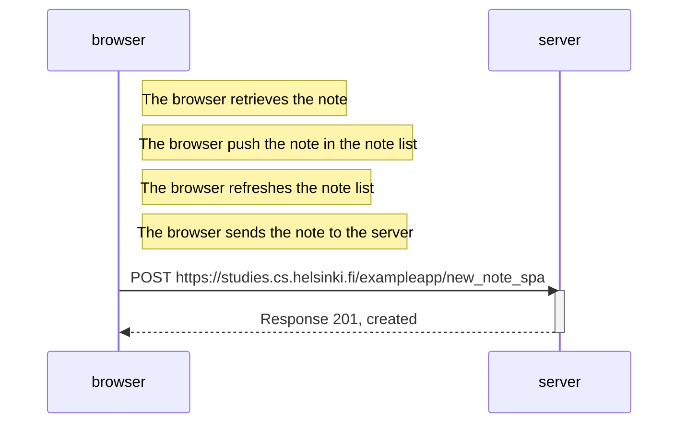

```mermaid
sequenceDiagram
    participant browser
    participant server

    Note right of browser: The browser retrieves the note
    Note right of browser: The browser push the note in the note list
    Note right of browser: The browser refreshes the note list
    Note right of browser: The browser sends the note to the server

    browser->>server: POST https://studies.cs.helsinki.fi/exampleapp/new_note_spa
    activate server
    server-->>browser: Response 201, created
    deactivate server

```